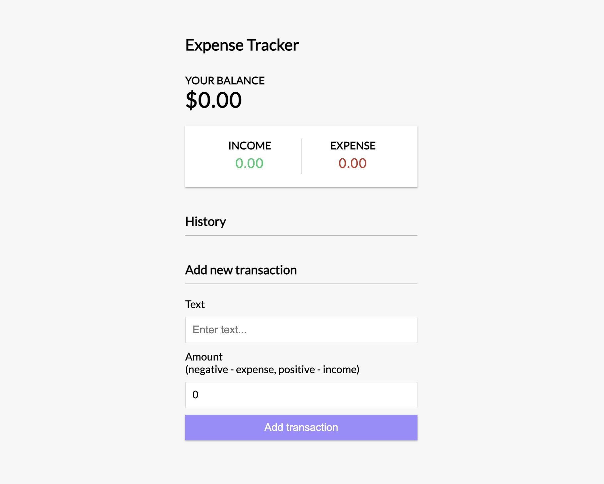

# React-expense-tracker

## What Did I Attempt To Build

For the hack-a-thing, I ended up working through a tutorial where I used React and Context API to create a expense tracking web app. I've never been very comfortable with React (I've only done one small project using React, where afterwards, I still felt like I had no idea what I was doing and how to use the framework) and wanted to take this opportunity to learn and apply React Hooks and Context API for the first time, as well as build my confidence in using React as a framework.

This is the link to the tutorial that I went through: https://www.youtube.com/watch?v=XuFDcZABiDQ&list=PLillGF-RfqbY3c2r0htQyVbDJJoBFE6Rb

This is what the expense tracking web app looks like:

The expense tracking web app allows a user to add and delete transactions and maintain a count of how much money the user may have based on the amounts inputted. It turned out successful because of the fact that it was a step by step tutorial, but it took me a very very long time to complete despite the fact that the tutorial was about an hour long. I spent most of the time trying to understand what the code was doing and would pause the tutorial to attempt to work out sections of the project on my own before looking back at the tutorial video for help.

## What you learned
1. I learned how to properly use React Hooks
2. Also learned about Context API and how it works
3. Not quite something I learned, but I do feel a lot more comfortable with React
4. I need to commit my code more often and follow best practices. I ended up not committing my code for a good chunk of time because I started my project as a local directory instead of git cloning a new repository in the beginning. That was a horrible idea. I was not consistently committing my code and pushing it. Then I messed up while trying to make my local directory into a repository and had to start everything over from scratch (the code, making the repository, basically everything)

## What didn’t work
1. Initially, I had intended on working on a to-do list-esque/task application using React and Flask as I really wanted to work on a project using React for the frontend and Python for the backend. That ended up horribly as I got no where near done with the project due to all the dependency problems I ran into while using Flask. I ended up deciding to move onto other potential projects because I couldn't figure out why Flask and Flask SQL-Alchemy wasn't working.
2. I also tried jumping into Django but again ran into dependency problems. I spent altogether 4 days jumping from project to project trying to figure out why I kept running into dependency problems. I eventually decided to steer away from Python as the project due date was getting closer and I didn't even have a partial project to potentially present/turn in.
3. Though generally the project did end up alright. There are still parts of the code that I don't have quite understand because I was following a tutorial and there was no in-depth explanation as to why some parts of the code needed to be included.
4. I ended up doing the tutorial twice because I really messed up setting up my repo and saving my coding progress.
